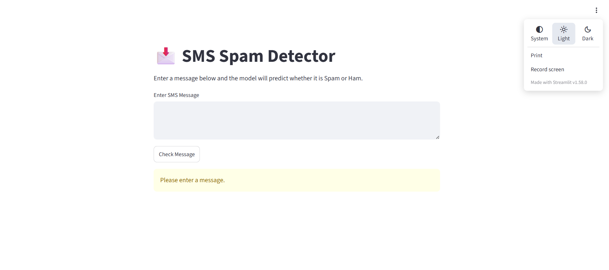
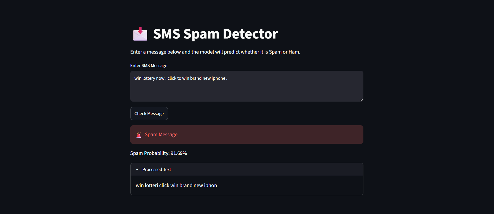
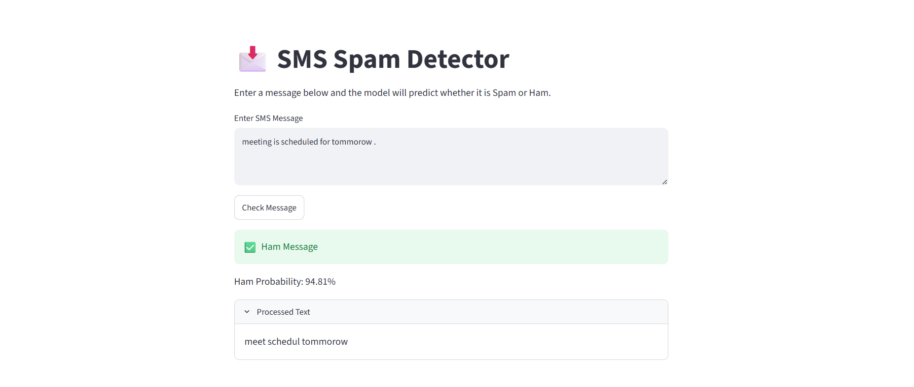

# 📩 SMS Spam Detection using NLP

An NLP-based machine learning application that classifies SMS messages as **Spam** or **Ham (Not Spam)** using TF-IDF Vectorization and Multinomial Naive Bayes.

The project includes a Streamlit web application that allows users to enter SMS messages and instantly receive predictions along with confidence scores.

---

## 🚀 Features

- Text preprocessing using NLTK
- Stopword removal
- Porter Stemming
- TF-IDF Vectorization
- Multinomial Naive Bayes Classifier
- Spam/Ham Prediction
- Confidence Score Display
- Interactive Streamlit Web App

---

## 🛠️ Technologies Used

- Python
- Pandas
- NumPy
- NLTK
- Scikit-Learn
- Streamlit

---

## 🔄 Workflow

1. Load SMS Dataset
2. Preprocess Text
   - Lowercase Conversion
   - Remove Special Characters
   - Tokenization
   - Stopword Removal
   - Stemming
3. Convert Text to Numerical Features using TF-IDF
4. Train Multinomial Naive Bayes Model
5. Save Model and Vectorizer
6. Deploy with Streamlit

---

## Folder Structure 

sms-spam-detector/
│
├── README.md
├──emailSpamDetection.ipynb
├── app.py
├── spam_model.pkl
├── tfidf.pkl
├── home.png
├── spam.png
└── ham.png

---

## 🧠 Example Predictions

### Spam

Input:

Congratulations! You have won a FREE iPhone. Claim now!

Prediction:

Spam 🚨

---

### Ham

Input:

Hey, are we meeting at 5 PM today?

Prediction:

Ham ✅

---

## 📸 Application Screenshots

### Home Page



### Spam Prediction



### Ham Prediction



---

## ⚙️ Installation

Clone the repository:

```bash
git clone http://github.com/sugandhi15/emailSpamDetector.git
